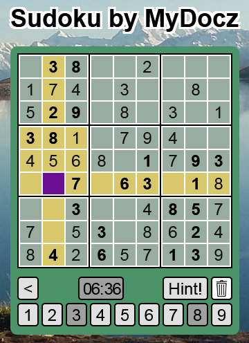

# Sudoku_Client
A Sudoku implementation to run in browsers, Android and iOS

<!--
*** Thanks for checking out the Best-README-Template. If you have a suggestion
*** that would make this better, please fork the repo and create a pull request
*** or simply open an issue with the tag "enhancement".
*** Thanks again! Now go create something AMAZING! :D
***
***
***
*** To avoid retyping too much info. Do a search and replace for the following:
*** github_username, repo_name, twitter_handle, email, project_title, project_description
-->


<!-- PROJECT SHIELDS -->
<!--
*** I'm using markdown "reference style" links for readability.
*** Reference links are enclosed in brackets [ ] instead of parentheses ( ).
*** See the bottom of this document for the declaration of the reference variables
*** for contributors-url, forks-url, etc. This is an optional, concise syntax you may use.
*** https://www.markdownguide.org/basic-syntax/#reference-style-links
-->
[![Contributors][contributors-shield]][contributors-url]
[![Forks][forks-shield]][forks-url]
[![Stargazers][stars-shield]][stars-url]
[![Issues][issues-shield]][issues-url]
[![MIT License][license-shield]][license-url]
[![LinkedIn][linkedin-shield]][linkedin-url]


<!-- PROJECT LOGO -->
<br />
<p align="center">
  <a href="https://github.com/GrumpyGel/Sudoku_Client">
    
  </a>

  <h3 align="center">SudokuClient</h3>

  <p align="center">
    A Sudoku implementation to run in browsers, Android and iOS
    <br />
    <a href="https://github.com/GrumpyGel/Sudoku_Client"><strong>Explore the docs »</strong></a>
    <br />
    <br />
    <a href="http://www.mydocz.com/Sudoku/Sudoku.html">View Demo</a>
    ·
    <a href="https://github.com/GrumpyGel/Sudoku_Client/issues">Report Bug</a>
    ·
    <a href="https://github.com/GrumpyGel/Sudoku_Client/issues">Request Feature</a>
  </p>
</p>


<!-- TABLE OF CONTENTS -->
<details open="open">
  <summary><h2 style="display: inline-block">Table of Contents</h2></summary>
  <ol>
    <li>
      <a href="#about-the-project">About The Project</a>
    </li>
    <li>
      <a href="#getting-started">Getting Started</a>
      <ul>
        <li><a href="#prerequisites">Prerequisites</a></li>
        <li><a href="#installation">Installation</a></li>
      </ul>
    </li>
    <li><a href="#usage">Usage</a></li>
    <li><a href="#roadmap">Roadmap</a></li>
    <li><a href="#contributing">Contributing</a></li>
    <li><a href="#license">License</a></li>
    <li><a href="#contact">Contact</a></li>
    <li><a href="#acknowledgements">Acknowledgements</a></li>
  </ol>
</details>


<!-- ABOUT THE PROJECT -->
## About The Project

A Sudoku implementation to run in browsers, Android and iOS.

The Sudoku Client is coded in HTML, CSS and JavaScript, all included in this repository.  This creates a stand alone functional Sudoku implementation to run in a browser.

Externally to the repository, the files have been included into a Cordova project and successfully executed as an Android app and can also be packaged as an app for running on Apple iOS.

Features from HTML5 and CSS3 are used to provide the responsive design to host the game within different device and providing a rich animated interface with audio. Current JavaScript storing scores locally between sessions and is structured with individual classes (SudokuScores, SudokuBoard, SudokuGame etc) each performing their own logic separated from the interface.

The Sudoku Client is intended as a showcase of technical functionality.  It is not intended to implement the most complex Sudoku solving logic.  As such it only has 2 levels of play - Easy and Medium.  These should though make the experience pleasurable for most casual Sudoku players.

The Sudoku Client is deisgned to operate with the Sudoku Server.  This enables players to publish their Best Times for viewing and comparison on the (www.MyDocz.com) website.

<!-- GETTING STARTED -->

## Installation

Clone the repo
   ```sh
   git clone https://github.com/GrumpyGel/Sudoku_Client.git
   ```


<!-- USAGE EXAMPLES -->
## Usage

Use this space to show useful examples of how a project can be used. Additional screenshots, code examples and demos work well in this space. You may also link to more resources.

_For more examples, please refer to the [Documentation](https://example.com)_


<!-- ROADMAP -->
## Roadmap

See the [open issues](https://github.com/GrumpyGel/Sudoku_Client/issues) for a list of proposed features (and known issues).


<!-- CONTRIBUTING -->
## Contributing

Contributions are what make the open source community such an amazing place to be learn, inspire, and create. Any contributions you make are **greatly appreciated**.

1. Fork the Project
2. Create your Feature Branch (`git checkout -b feature/AmazingFeature`)
3. Commit your Changes (`git commit -m 'Add some AmazingFeature'`)
4. Push to the Branch (`git push origin feature/AmazingFeature`)
5. Open a Pull Request


<!-- LICENSE -->
## License

Distributed under the MIT License. See `LICENSE` for more information.


<!-- CONTACT -->
## Contact

Email - [grumpygel@mydocz.com](mailto:grumpygel@mydocz.com)

Project Link: [https://github.com/GrumpyGel/Sudoku_Client](https://github.com/GrumpyGel/Sudoku_Client)


<!-- ACKNOWLEDGEMENTS -->
## Acknowledgements

* [Best-README-Template](https://github.com/othneildrew/Best-README-Template)
* [Ajv JSON schema validator](https://ajv.js.org/)


<!-- MARKDOWN LINKS & IMAGES -->
<!-- https://www.markdownguide.org/basic-syntax/#reference-style-links -->
[contributors-shield]: https://img.shields.io/github/contributors/GrumpyGel/Sudoku_Client.svg?style=for-the-badge
[contributors-url]: https://github.com/GrumpyGel/Sudoku_Client/graphs/contributors
[forks-shield]: https://img.shields.io/github/forks/GrumpyGel/Sudoku_Client.svg?style=for-the-badge
[forks-url]: https://github.com/GrumpyGel/Sudoku_Client/network/members
[stars-shield]: https://img.shields.io/github/stars/GrumpyGel/Sudoku_Client.svg?style=for-the-badge
[stars-url]: https://github.com/GrumpyGel/Sudoku_Client/stargazers
[issues-shield]: https://img.shields.io/github/issues/GrumpyGel/Sudoku_Client.svg?style=for-the-badge
[issues-url]: https://github.com/GrumpyGel/Sudoku_Client/issues
[license-shield]: https://img.shields.io/github/license/GrumpyGel/Sudoku_Client.svg?style=for-the-badge
[license-url]: https://github.com/GrumpyGel/Sudoku_Client/blob/master/LICENSE.txt
[linkedin-shield]: https://img.shields.io/badge/-LinkedIn-black.svg?style=for-the-badge&logo=linkedin&colorB=555
[linkedin-url]: https://linkedin.com/in/gerald-moull-41b5265
